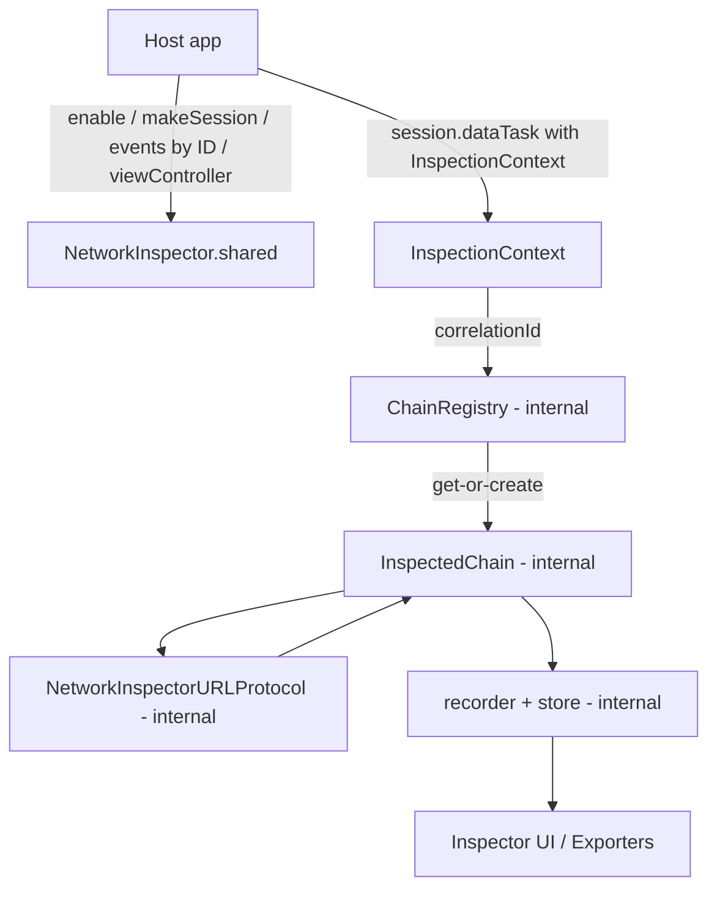
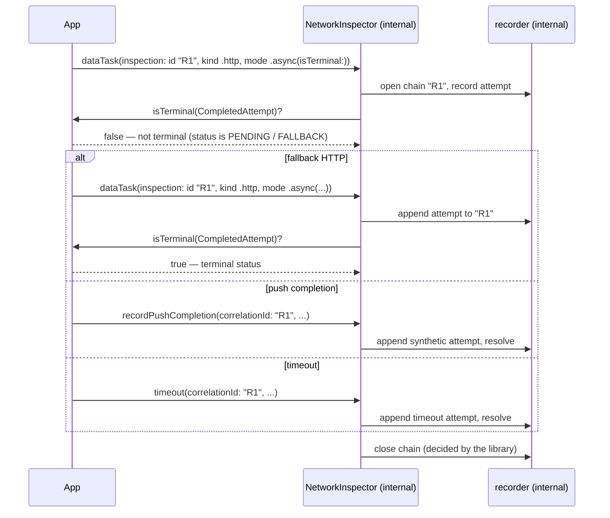

# NetworkInspector

`NetworkInspector` is a reusable iOS pod for tracking request/response chains, inspecting payloads, and modeling multi-stage transport lifecycles such as fallback retries, timeouts, and externally delivered completions.

The public API is one facade and one value struct:

| Type | Role |
| --- | --- |
| `NetworkInspector.shared` | The single entry point — enable/disable, session building, ID-addressed chain events, inspector UI |
| `InspectionContext` | Declares one HTTP attempt at issue time: correlation ID, tag, kind, decryptor, mode |

There is **no chain handle**. Chain identity is the `correlationId`: attempts
issued with the same ID land on the same chain (atomic get-or-create inside
the library); a fresh ID opens a new chain. Everything else (URLProtocol
interceptor, chain state machines, recorder, in-memory store) is internal.

## Install

```ruby
pod 'NetworkToolKit',
    :git => 'https://github.com/salma-kamaleldin/NetworkToolKit.git',
    :tag => '1.0.0'
```

`NetworkInspector` is intended to be consumed as a remote tagged pod from the
dedicated `NetworkToolKit` repository.

## Quick start

### 1. Enable once at app startup — *before* building your network stack

Recording is **off by default**. While disabled, every API is inert and free:
sessions come back uninstrumented, tasks degrade to plain `dataTask`s.
`enable()` is also a **no-op in App Store builds** (detected via the store
receipt), so it is safe to call unconditionally from debug menus and internal
builds.

```swift
import NetworkToolKit

NetworkInspector.shared.enable(
    uiConfiguration: .init(
        environment: "UAT",
        exportFormats: [.plainText, .markdown]
    ),
    configuration: .init(
        maxChains: 200,
        maxPendingChains: 500,
        pendingChainTTL: 15 * 60
    )
)
```

> **Ordering matters:** the transport interceptor is installed when a session
> is created. Call `enable()` before `makeSession(...)`.

### 2. Build your session through the facade

```swift
let session = NetworkInspector.shared.makeSession(
    configuration: .default,
    forwardingTo: certificatePinner // your URLSessionDelegate; pinning keeps working
)
```

### 3. Issue tasks with an `InspectionContext`

```swift
let task = session.dataTask(
    with: request,
    inspection: .init(tag: "/login")   // correlationId defaults to a fresh UUID
) { data, response, error in
    ...
}
task.resume()
```

For multi-attempt flows, supply the same `correlationId` on every attempt —
the library groups them into one chain and closes it according to `mode`.

### 4. Present the UI from a debug menu

```swift
let inspector = UINavigationController(
    rootViewController: NetworkInspector.shared.viewController()
)
present(inspector, animated: true)
```

## Architecture map



The interceptor carries per-request context as a `URLProtocol` property on the
request itself — nothing is added to HTTP headers, so no inspector metadata can
ever reach the wire.

## Usage flow

### Deferred lifecycle flow (fallback / push / timeout)



## API surface

| Need | Call |
| --- | --- |
| Turn recording on/off | `NetworkInspector.shared.enable(...)` / `.disable()` |
| Check state | `NetworkInspector.shared.isEnabled` |
| Build a tracked session | `NetworkInspector.shared.makeSession(configuration:forwardingTo:delegateQueue:)` |
| Issue a tracked HTTP attempt | `session.dataTask(with:inspection:completionHandler:)` |
| Group attempts into one chain | reuse the same `InspectionContext.correlationId` |
| Declare how the attempt ends the chain | `mode: .sync` (auto-close) or `.async(isTerminal:)` (the closure decides) |
| Bound how long an async chain may wait | `.async(maxOpenInterval: 60, isTerminal: ...)` — the library auto-closes when it elapses |
| Record a push-notification completion | `NetworkInspector.shared.recordPushCompletion(correlationId:request:result:)` |
| Record a timeout as the terminal event | `NetworkInspector.shared.timeout(correlationId:request:error:)` |
| Escape hatch | `NetworkInspector.shared.closeChainIfOpen(correlationId:)` |
| Show the inspector UI | `NetworkInspector.shared.viewController()` |

Supporting public types: `InspectionContext`, `RequestMode`,
`CompletedAttempt`, `AttemptKind`, `AttemptResult`, `AttemptDecryptor`,
`NetworkRequestSnapshot` / `NetworkResponseSnapshot`,
and the two configuration structs.

## Chain identity rules

- Attempts with the same `correlationId` belong to one chain while it is
  **open** (in flight or awaiting a follow-up).
- An ID whose chain already **resolved** opens a *new* chain — use fresh
  IDs per logical request (UUIDs) to avoid surprises.
- Get-or-create is atomic: two attempts racing on the same ID always land on
  the same chain; an attempt issued while another is still in flight on the
  same chain is dropped (invalid transition), matching the state machine.

## 1. Plain HTTP example

For a request that starts and finishes with one HTTP call, the default
`mode` (`.sync`) closes the chain automatically when the attempt completes —
no bookkeeping at all.

```swift
import Foundation
import NetworkToolKit

final class APIClient {
    private let session = NetworkInspector.shared.makeSession(configuration: .default)

    func login() {
        var request = URLRequest(url: URL(string: "https://example.com/login")!)
        request.httpMethod = "POST"
        request.setValue("application/json", forHTTPHeaderField: "Content-Type")
        request.httpBody = Data(#"{"username":"demo","password":"1234"}"#.utf8)

        let task = session.dataTask(with: request, inspection: .init(tag: "/login")) { data, response, error in
            if let error {
                print("login failed:", error)
                return
            }

            guard let data, let response = response as? HTTPURLResponse else { return }
            print("login status:", response.statusCode)
            print("login body:", String(decoding: data, as: UTF8.self))
        }

        task.resume()
    }
}
```

## 2. Fallback / external completion example

Use `mode: .async(isTerminal:)` when one logical request may continue after
the first HTTP response. The closure receives each finished attempt (raw
bytes + the attempt's decryptor, so encrypted envelopes can be opened) and
returns `true` when the decoded status is terminal (the library closes the
chain) or `false` while fallbacks or a push may still arrive.
Transport errors never consult the closure; the chain stays open for
follow-ups, bounded by `maxOpenInterval` if provided.

```swift
import Foundation
import NetworkToolKit

enum PaymentFlowError: Error {
    case timeout
    case invalidResponse
}

final class PaymentFlow {
    private let session: URLSession
    private let correlationId = UUID().uuidString   // one ID = one chain
    private var pushProbeRequest: URLRequest {
        URLRequest(url: URL(string: "push://payment/result")!)
    }

    /// One declaration of "when is this logical request over".
    private static let mode = RequestMode.async(maxOpenInterval: 60) { attempt in
        guard
            let statusCode = attempt.statusCode, (200..<300).contains(statusCode),
            let json = try? JSONSerialization.jsonObject(with: attempt.body) as? [String: Any],
            let status = json["status"] as? String
        else {
            return false // errors are resolved by fallback/push/timeout
        }

        switch status {
        case "PENDING", "FALLBACK": return false
        default:                    return true
        }
    }

    init(session: URLSession) {
        self.session = session
    }

    private var inspection: InspectionContext {
        .init(correlationId: correlationId, tag: "payment", mode: Self.mode)
    }

    func start(completion: @escaping (Result<String, Error>) -> Void) {
        var primaryRequest = URLRequest(url: URL(string: "https://example.com/payment")!)
        primaryRequest.httpMethod = "POST"

        let task = session.dataTask(
            with: primaryRequest,
            inspection: inspection
        ) { [weak self] data, response, error in
            guard let self else { return }

            if let error {
                completion(.failure(error))
                return
            }

            guard
                let data,
                let json = try? JSONSerialization.jsonObject(with: data) as? [String: Any],
                let status = json["status"] as? String
            else {
                completion(.failure(PaymentFlowError.invalidResponse))
                return
            }

            switch status {
            case "SUCCEEDED":
                completion(.success("Payment succeeded")) // chain already closed by mode

            case "FALLBACK":
                self.startFallback(completion: completion)

            case "PENDING":
                break // chain stays open (isTerminal said false) until push/timeout

            default:
                completion(.failure(PaymentFlowError.invalidResponse))
            }
        }

        task.resume()
    }

    private func startFallback(completion: @escaping (Result<String, Error>) -> Void) {
        var fallbackRequest = URLRequest(url: URL(string: "https://example.com/payment/fallback")!)
        fallbackRequest.httpMethod = "POST"

        let task = session.dataTask(
            with: fallbackRequest,
            inspection: inspection  // same correlationId → same chain
        ) { data, response, error in
            if let error {
                completion(.failure(error))
                return
            }

            completion(.success("Fallback succeeded")) // mode closed the chain
        }

        task.resume()
    }

    func handlePushResult(payload: String, completion: @escaping (Result<String, Error>) -> Void) {
        NetworkInspector.shared.recordPushCompletion(
            correlationId: correlationId,
            request: pushProbeRequest,
            result: .success(
                data: Data(payload.utf8),
                response: NetworkResponseSnapshot(statusCode: 200, headers: [:])
            )
        )

        completion(.success("Push resolved"))
    }

    func timeout() {
        NetworkInspector.shared.timeout(
            correlationId: correlationId,
            request: pushProbeRequest,
            error: PaymentFlowError.timeout
        )
    }
}
```

## Integration rules

### `mode: .sync` (the default) when

- one HTTP call starts and finishes the logical operation
- no fallback or deferred completion path exists

### `mode: .async(isTerminal:)` when

- the first transport result may not be final
- retries or fallback requests belong to the same logical chain
- a push, timeout, polling result, or synthetic event may finish the request later

Rules the library enforces for `.async`:

- successful attempts consult `isTerminal`; its verdict closes or keeps the chain
- transport errors never consult the closure — the chain stays open for follow-ups
- `maxOpenInterval` (if provided) auto-closes a chain no follow-up ever reached
- push (`recordPushCompletion`) and `timeout(...)` always resolve the chain themselves

The closure runs on the transport's callback queue: keep it cheap (decode a
small envelope), and don't capture heavy objects strongly.

## Decoupled consumption (recommended for frameworks)

Frameworks that don't want a source-level dependency on this pod should
define their own small inspection seam (protocol + no-op default) and bridge
it with a single adapter file using `RequestInspecting` / `NoOpInspector` / `RequestInspector`:

```swift
// Store builds / inspector off — plain networking, no inspector types anywhere:
let service = NetworkServiceFactory.makeSecureChannel(
    configuration: config,
    pushNotificationsProvider: push,
    inspector: NoOpInspector()
)

// Non-store builds:
NetworkInspector.shared.enable(uiConfiguration: .init(environment: "UAT"))
let service = NetworkServiceFactory.makeSecureChannel(
    configuration: config,
    pushNotificationsProvider: push,
    inspector: RequestInspector()
)
```

## Cross-platform core contract

| iOS | Android |
| --- | --- |
| `NetworkInspector.shared.enable(...)` | `NetworkInspector.enable(...)` |
| `NetworkInspector.shared.makeSession(...)` | `OkHttpClient.Builder` + inspector `Interceptor` |
| `session.dataTask(with:inspection:)` | `client.newCall(request.tag(InspectionContext(...)))` |
| same `correlationId` → same chain | identical (registry get-or-create) |
| `mode: .sync` / `.async(isTerminal:)` | sealed class + lambda, identical semantics |
| `recordPushCompletion(correlationId:...)` | identical |
| context via `URLProtocol` request property | context via `Request.tag()` |

## Mental model

- `NetworkInspector.shared` is the only door — enable, sessions, ID-addressed events, UI
- `InspectionContext` declares one HTTP attempt; its `correlationId` *is* the chain identity
- same ID while the chain is open → append; resolved or unknown ID → new chain
- `mode` declares how the attempt ends the chain: `.sync` auto-closes,
  `.async(isTerminal:)` lets your closure decide — the library does the closing
- `recordPushCompletion` / `timeout` record non-URLSession terminal events by ID
- Disabled (or App Store build) ⇒ every call above is an inert no-op
